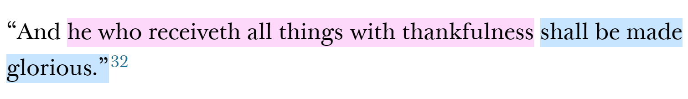
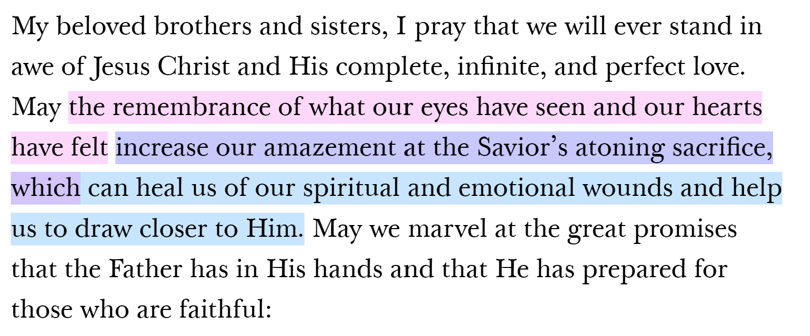

# Elder's Quorum Lesson - In Awe of Jesus Christ and His Gospel

#### Link to Ulisses Soares's talk: 
https://www.churchofjesuschrist.org/study/general-conference/2022/04/55soares?lang=eng

### Focuses in the talk; we are to:
1. Understand Christ’s invitation
1. Understand what “Awe for Christ and His Gospel” is, and its blessings
1. Understand the primary roadblocks to gaining awe and staying in awe 
1. Understand what spiritual apathy, and its problems
1. Understand Christ’s role and our role in overcoming those roadblocks and achieving blessings
1. Understand examples of having apathy, awe, and helping others gain awe
1. Commit to do our part and rely on Christ to overcome those roadblocks and achieve blessings

### One Sentence Doctrinal Summary
By learning of Christ and following His invitations, we can be permanently rooted in Christ’s gospel, have Joy, and help us and others avoid dangerous pitfalls that may prevent us from returning home to God. 

## How to Extract If-Then/Cause-Effect Principles/Statements

This is easy. Anyone can do it. I usually highlight two different colors to help visually see that something is causing something. For me, in these examples from the talks: 
* Red == If 
* Blue == Then

Here is an easy example. 

For this, I write: 
* Receiving all things in thankfulness -> Being made glorious

This is a more complex example, where there are two if-then statements, Elder Soares just uses the 1st "then" as the "if" for the second if-then statement.

For this, I write: 
* Remembering what our eyes have seen and our hearts have felt concerning Christ -> increased amazement at what Christ did
* Increased amazement at what Christ did -> 
   * Healing from our spiritual and emotional wounds 
   * Drawing closer to Christ

# Group Instructions: 
1. Compile the if-then/cause-effect statements as a group, and put them on the board. 
   1. Board scribe: Assign another person who will write the statements on the whiteboard
   4. Communication facilitator: Assign another person to help the white-board-writer communicate with the group and board scribe. They make sure the person can write on the board fast and consistently. 
4. As a group, read out loud each assigned paragraph (or the one paragraph), stopping every time you identify if-then statements. 
   8. The communication facilitator tells the board scribe what to write on the board
   9. The board scribe writes them on the board, connecting things with arrows
9. A note: **There are a lot of awesome things... you probably won't have time to write them all down. So pick the most significant ones to your group, and write them down**.
10. You may cheat and see an extended diagram by clicking the "Cheat" link for your group. It would be cooler though if you figured it out as a group though, but it may give you helpful ideas. 😄

## Group 1 Paragraphs
P6-9

