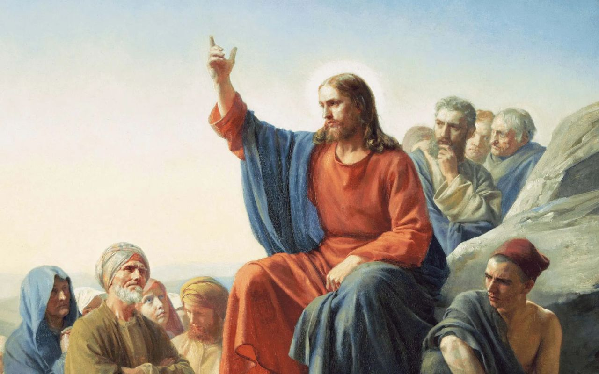

# Are You Still Willing?

[Link to Kevin W. Pearson's talk: ](https://www.churchofjesuschrist.org/study/general-conference/2022/10/33pearson)

President Gubler's promise at the end of stake conference:
> "If we will take some steps, our Faith will increase."

# Discussion

## 1

---

How does the world look at spiritual willingness? How might we be tempted to look at our commitment to Christ and His Gospel?

https://www.churchofjesuschrist.org/study/general-conference/2022/10/33pearson?lang=eng&id=5#5

## 2

---

How does Christ hope we will think about willingness? How willing was Christ?

https://www.churchofjesuschrist.org/study/general-conference/2022/10/33pearson?lang=eng&id=4#4

## - Group 1

---

How can we know how willing we are?

https://www.churchofjesuschrist.org/study/general-conference/2022/10/33pearson?lang=eng&id=6#6

https://www.churchofjesuschrist.org/study/general-conference/2022/10/33pearson?lang=eng&id=8#8

## - Group 2

---

What is the cost of discipleship? What are the two aspects of the cost of discipleship?

https://www.churchofjesuschrist.org/study/general-conference/2022/10/33pearson?lang=eng&id=10#10

## - Group 3

---

Why should we obey the commandments, and why should we want the Holy Ghost?

https://www.churchofjesuschrist.org/study/general-conference/2022/10/33pearson?lang=eng&id=11#11

## Other questions

---

What experiences have you all had that have taught you that the companionship of the Holy Ghost is priceless?

https://www.churchofjesuschrist.org/study/general-conference/2022/10/33pearson?lang=eng&id=23#23 

- Why do people our age leave their covenants? 

Part of the cost of discipleship is knowing God's will. How do we learn the will of the Lord, so that we can do it?

# Individually Picture, Ponder, and Pray

### Observe all the people around Christ in this picture. Where are you in this picture? 

 

### "What changes in [my] personal life would enable [me] to have the influence of the Holy Ghost more constantly?"

